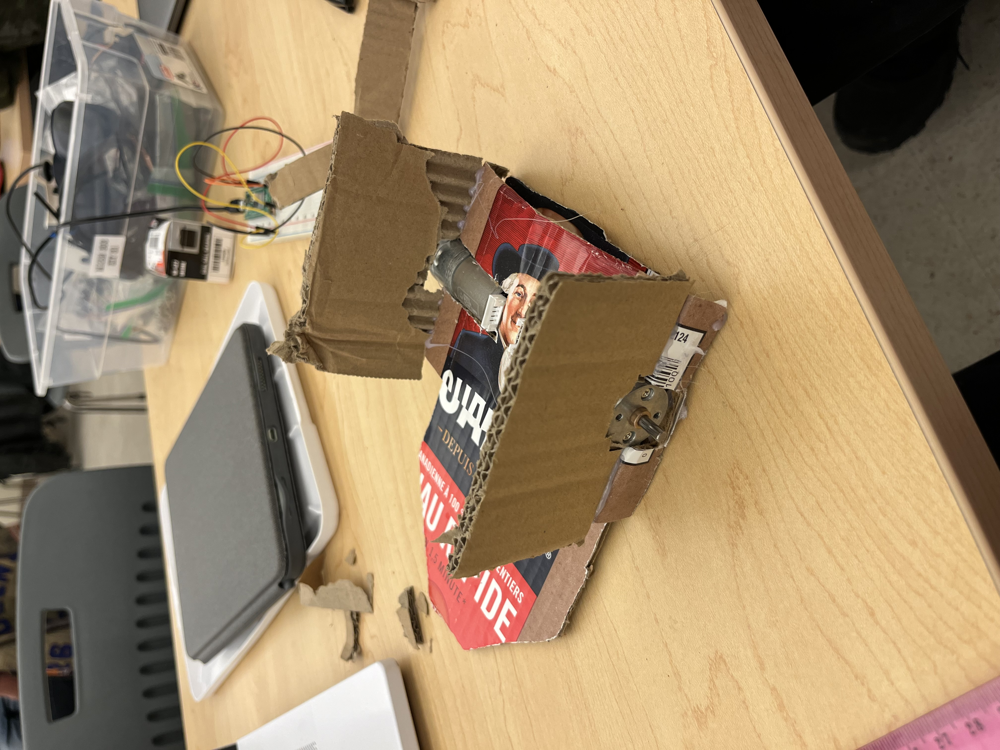
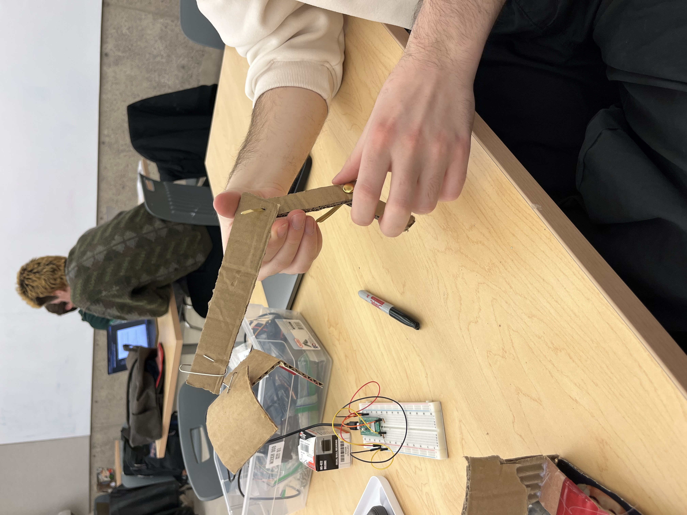

# Brainstorming Ideas:

## Round 1 Meeting Minutes
Note: Much of the following brainstorming idea's taken during group work session with HolyTrinity before group was dismantled

## Ideas Discussed
1. **Crab-Based Robotic Bot**
   - TPU Arm Extenders
   - Ratchet tightening mechanism
   - Drive into the dinosaurs and collect them all at once

   **Pros:**
   - Simple dinosaur collection method
   - Relatively straightforward design

   **Cons:** 
   - Uncertainty about how to collect Ken
   - Risk of dinosaurs being dropped after collection
   - Requires a method to lift the entire payload into the cage, unless sideways approach on the ramp is feasible

2. **Street Sweeper Mechanism**
   - Sweeper positioned at the front of the bot
   - Belt driven by DC motors
   - Potential use of a servo to control the pitch
   - Bladed sweeper to remove Ken from the trench

   **Pros:**
   - No need for additional servo motors

   **Cons:**
   - Occupies the front half of the robot
   - Lacks further manipulation ability for the payload after "sweeping"
   - Adding complexity to control the sweeper using a DC motor belt

3. **Dump-Truck Carrier**
   - Large collection bed at the rear of the robot
   - Robot moves between dinosaurs to load them into the bed
   - Once the load is complete, the entire load is dumped into the cage at once
   - Requires a robotic arm to load the bed

   **Pros:**
   - Saves time by eliminating the need to return to the cage after each dinosaur collection
   - Can also be used for collecting minions

   **Cons:**
   - Needs one servo to dump the truckload (unless spring-loaded for one-time use)
   - Significant materials needed to build the truck bed
   - The bed is ineffective for collecting Ken

4. **Simple 2-Wheeled Robot with Caster and Robust Arm**
   - Simplifies the drivetrain by dedicating resources to a versatile grabbing mechanism with a 2-joint robot arm
   
   **Pros:**
   - Enhances the arm's versatility, allowing collection of all points with a single gripper
   - Simplifies the drivetrain, reducing risks associated with mobility errors

5. **Design #4 With Updated Features**
   - Robot arm is now one joint instead of two and moves up and down
   - Gripper is comprised of a scoop on the bottom which collects the dinosaurs and then has a top piece that closes down on the scooper to grip the dinosaur

   **Pros:**
   - Scooper design with closing lid can grab any object
   - One joint arm means that it will be powered by two servo motors instead of one which makes it stronger

   **Cons:**
   - Smaller range of movement with only one joint

## 2.1 Reflection on Cardboard Prototyping

1. What did you set out to do?
   - Create the most optimal and efficient design for a robot with the limited amount of resources given.
   - Come up with multiple different ideas to test different types of robots and arm designs to find the one most suited for the given challenge.
   - Determine the ideal robot design across all the prototypes.
    

2. What did you learn from your prototype?
   - The base of the robot needed to be much larger than the team originally anticipated to have enough room for the two motors used to control the wheels.
   - The weight of the arm would be too much for one servo motor to lift and because one motor is already being used on the gripper mechanism, an arm with two servo motor joints would not work and had to be changed. 
   - The most efficient gripper design is the one from idea 5 with a grabbing scoop mechanism, this would allow for collection of the dinosaurs, minions and Ken.
   
3. What changes do you propose based on these insights?
   - The base of the robot will be made wider to accomodate the two wheel motors. 
   - The robot arm will only move up and down with one joint controlled by two servo motors to account for its weight, instead of one.
   - The gripper will have a large scoop on the bottom and a servo motor-controlled opening and closing mechanism.

