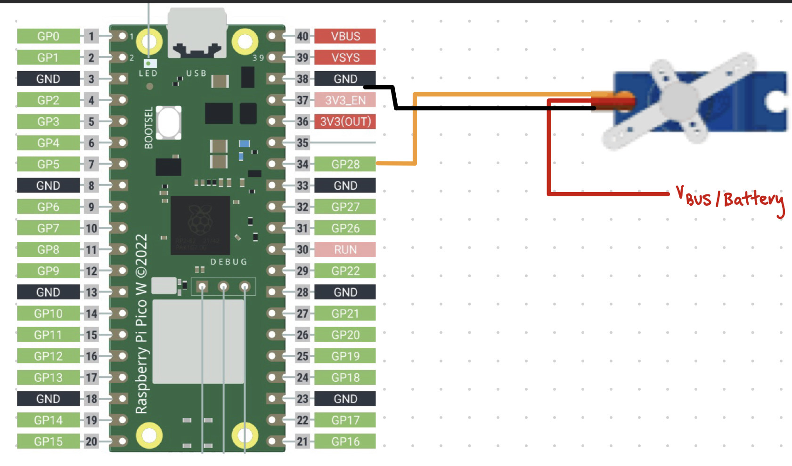
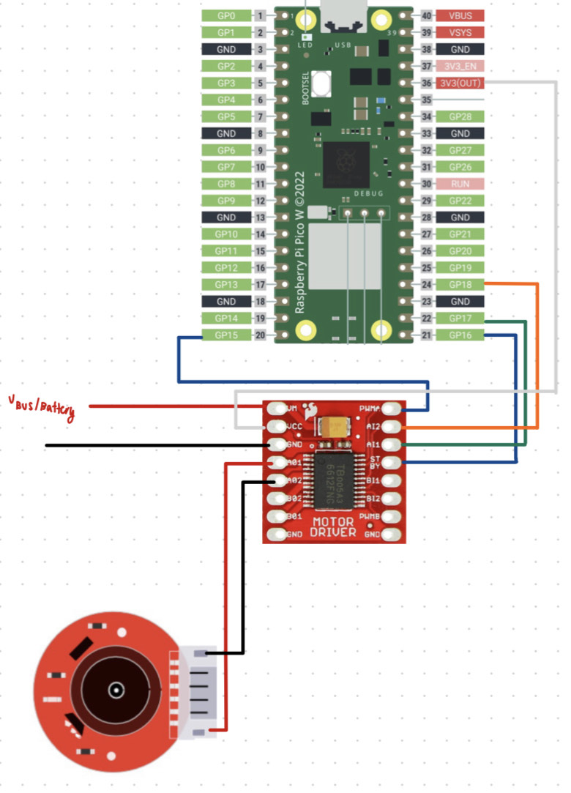
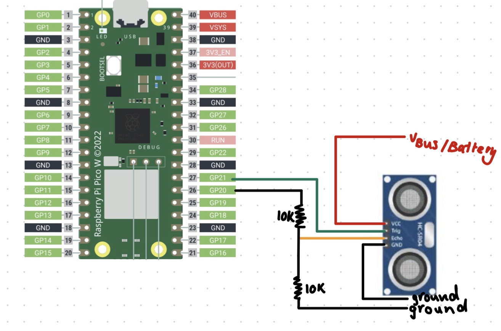
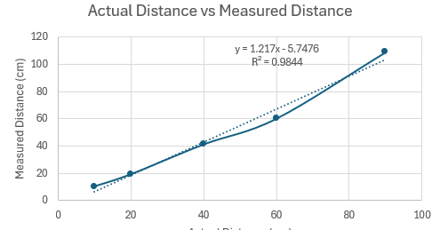
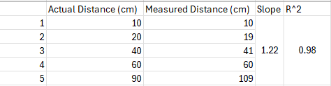

## Sensor Configuration Summary
Over the course of round 2, the team has put an emphasis on initializing all of the sensor and actuators. All of the individual sensors/actuators were succesfully implemented using the following programs.

- Scripts: `TestServo.ino`, `DCMotor_Test.ino`, and `ultrasound_test.ino`.

### Servo Motor Initialization
In order to implement the servo motor the following electrical implementation was used. 

 

This hardware congiguration was combined with 'TestServo.ino' and was succesfully able to manouvre the servo from position 1 - 0 degreees to positions 2 - 180 degrees and then back again

### DC Motor Initialization
The DC motor required a more complex set up process to ensure the correct voltage and current reached the motor to provide safe and reliable movement. The following electrical configuation was used for setting up the DC motor.

 

###  Ultrasonic Sensor Configuration
The ultrasonic sensor was relitively easy to setup requiring a simple configration as seen below

 

In order to ensure that the sensor was correctly reading a simple analysis of the output was conducted providing the following results.

 
 

#### Discussion

The ultrasonic very effectively gets the range up close (from about 4 - 70cm) but as the range get further the sensor becomes slightly less accuate as seen by the results in the table. This is expected as with an increased range there's a greater degree of error which is likely related to the noise of the sesnor. Overall, these sensors should be effective as during this competition there will not be many times where the sensor is reading greater than a meter in front of it.

