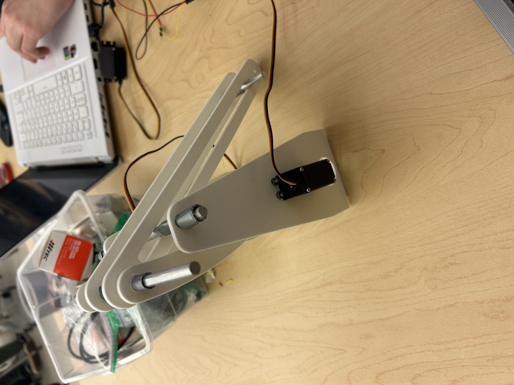

What are the specific goals for this round? Aside from meeting this round’s design review deliverables, what are your own goals?

    - To have all the robot CAD parts ready for lasercutting/printing.
    - Begin putting the robot together 
    - 3D print and test a gripper prototype to make sure it works and fits on the arm

What are the backlog items from last round?

    - None

What are the tasks needed to achieve each goal, including the backlog items?

    - Finish designing all the parts for the robot in Solidworks or Fusion
    - Begin 3D printing or lasercutting the parts, including a gripper prototype
    - Laser cut the base of the robot and begin putting the breadboard and other components on it
    
Who is responsible for each task/goal?

    - Paul will write the documentation
    - Josh will make the electric schematic
    - Paul will design and 3D print the gripper
    - Josh will design and 3D print the arm
    - Both will put the parts together and start building the robot

Additional components for 3D printing/lasercutting

    - Base (Laser Cut)
    - Gripper (3D Print) 
    - Wheels (3D Print)
    - Bumper (3D Print)
    
Mechanical Module

  

    The mechanical module is only the arm portion of the robot. It was 3D printed in multiple parts and then assembled with
    duct tape and metal rods. The prints had holes on them which were intended for the metal rods to go through to connect 
    the pieces, but they were too small and needed to be drilled out and widened. The metal rods were then placed through 
    the parts and secured with more duct tape on either end to keep the parts from sliding around. The arm rests on the 
    ground and the servo motors rotate the curved pieces which move the longer pieces up and down. The longer pieces are 
    restricted to sliding along the metal rod as they move which stabilizes and reduces the load on the arm. The rod going 
    through the end of the long pieces is where the gripper will eventually be attached once it has been printed.

